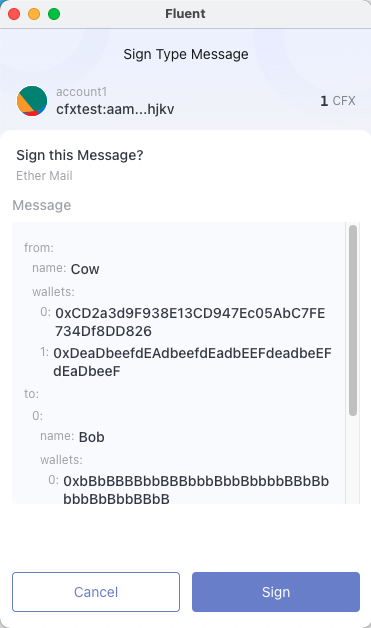
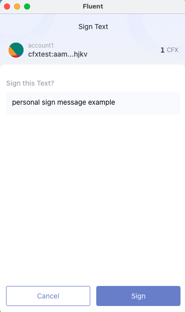

# Sign data

You can use the following RPC methods to request cryptographic signatures from users:

- [`cfx_signTypedData_v4`](#use-cfx_signtypeddata_v4) - Use this method to request the most human-readable
  signatures that are efficient to process on-chain.
  We recommend this for most use cases.
- [`personal_sign`](#use-personal_sign) - Use this method for the easiest way to request human-readable
  signatures that don't need to be efficiently processed on-chain.

Read more about [the history of the signing methods](../concepts/signing-methods.md).


:::note
Fluent supports signing transactions using  Ledger hardware wallets.
These wallets only support signing data using `personal_sign`.
If you can't log in to a dapp when using a Ledger, the dapp might be requesting you to
sign data using an unsupported method, in which case we recommend using your standard Fluent account.
:::

## Use cfx_signTypedData_v4

[`cfx_signTypedData_v4`](https://conflux-chain.github.io/fluent-wallet-doc/docs/provider-rpc/#cfx_signtypeddata_v4)
provides the most human-readable signatures that are efficient to process on-chain.
It follows the [EIP-712](https://eips.ethereum.org/EIPS/eip-712) specification to allow users to sign
typed structured data that can be verified on-chain.
It renders the structured data as usefully as possible to the user (for example, displaying known
account names in place of addresses).

<p align="center">



</p>

An `cfx_signTypedData_v4` payload uses a standard format of encoding structs, but has a different
format for the top-level struct that is signed, which includes some metadata about the verifying
contract to provide replay protection of these signatures between different contract instances.

We recommend using [`js-conflux-sdk`](https://github.com/Conflux-Chain/js-conflux-sdk) to generate and
validate signatures.
You can use [`cip-23`](https://github.com/conflux-fans/cip-23) to generate most
of the Solidity required to verify these signatures on-chain.


:::caution
Since the top-level struct type's name and the `domain.name` are presented to the user prominently
in the confirmation, consider your contract name, the top-level struct name, and the struct keys to
be a user-facing security interface.
Ensure your contract is as readable as possible to the user.
:::

### Example

The following is an example of using `cfx_signTypedData_v4` with Fluent.
See the [live example](https://dapp-demo.fluentwallet.dev/) and
[test dapp source code](https://github.com/Conflux-Chain/helios/tree/dev/examples/basic-dapp).

<!--tabs-->

# JavaScript

```javascript
import { getMessage,publicKeyToAddress } from 'cip-23';

signTypedDataV4Button.addEventListener('click', async function (event) {
  event.preventDefault();

  // cfx_signTypedData_v4 parameters. All of these parameters affect the resulting signature.
  const msgParams = JSON.stringify({
    types: {
      CIP23Domain: [
        {name: 'name', type: 'string'},
        {name: 'version', type: 'string'},
        {name: 'chainId', type: 'uint256'},
        {name: 'verifyingContract', type: 'address'},
      ],
      Person: [
        {name: 'name', type: 'string'},
        {name: 'wallets', type: 'address[]'},
      ],
      Mail: [
        {name: 'from', type: 'Person'},
        {name: 'to', type: 'Person[]'},
        {name: 'contents', type: 'string'},
      ],
      Group: [
        {name: 'name', type: 'string'},
        {name: 'members', type: 'Person[]'},
      ],
    },
    domain: {
      name: 'Ether Mail',
      version: '1',
      chainId: 1,
      verifyingContract: '0xCcCCccccCCCCcCCCCCCcCcCccCcCCCcCcccccccC',
    },
    primaryType: 'Mail',
    message: {
      from: {
        name: 'Cow',
        wallets: [
          '0xCD2a3d9F938E13CD947Ec05AbC7FE734Df8DD826',
          '0xDeaDbeefdEAdbeefdEadbEEFdeadbeEFdEaDbeeF',
        ],
      },
      to: [
        {
          name: 'Bob',
          wallets: [
            '0xbBbBBBBbbBBBbbbBbbBbbbbBBbBbbbbBbBbbBBbB',
            '0xB0BdaBea57B0BDABeA57b0bdABEA57b0BDabEa57',
            '0xB0B0b0b0b0b0B000000000000000000000000000',
          ],
        },
      ],
      contents: 'Hello, Bob!',
    },
  });

  const [from] = await provider.request({method: 'cfx_accounts'});

  var params = [from, msgParams];
  var method = 'cfx_signTypedData_v4';
  const hash = getMessage(msgParams, true).toString('hex');

  provider.request(
    {
      method,
      params,
    }
  ).then(result=>{
      const recovered = sign.ecdsaRecover(
        hash,result,
      );

      if (
        sign.publicKeyToAddress(recovered) === format.hexAddress(from)
      ) {
        alert('Successfully recovered signer as ' + from);
      } else {
        alert(
          'Failed to verify signer when comparing ' + result + ' to ' + from
        );
      }
  }).catch(error=>console.error(error));
});
```

# HTML

```html
<h3>Sign typed data v4</h3>
<button type="button" id="signTypedDataV4Button">cfx_signTypedData_v4</button>
```

<!--/tabs-->

## Use personal_sign

[`personal_sign`](https://conflux-chain.github.io/fluent-wallet-doc/docs/provider-rpc/#personal_sign) is the
easiest way to request human-readable signatures that don't need to be efficiently processed on-chain.
It's often used for signature challenges that are authenticated on a web server.

<p align="center">



</p>


:::caution important
- Don't use this method to display binary data, because the user wouldn't be able to understand what
  they're agreeing to.
- If using this method for a signature challenge, think about what would prevent a phisher from
  reusing the same challenge and impersonating your site.
  Add text referring to your domain, or the current time, so the user can easily verify if this
  challenge is legitimate.
:::

### Example

The following is an example of using `personal_sign` with Fluent.
See the [live example](https://dapp-demo.fluentwallet.dev/) and
[test dapp source code](https://github.com/Conflux-Chain/helios/tree/dev/examples/basic-dapp).

<!--tabs-->

# JavaScript

```javascript
personalSignButton.addEventListener('click', async function (event) {
  event.preventDefault();
  const exampleMessage = 'Example `personal_sign` message.';
  try {
    const [from] = await provider.request({method: 'cfx_accounts'});
    const sign = await provider.request({
      method: 'personal_sign',
      params: [exampleMessage, from],
    });
    personalSignResult.innerHTML = sign;
    personalSignVerify.disabled = false;
  } catch (err) {
    console.error(err);
    personalSign.innerHTML = `Error: ${err.message}`;
  }
});
```

# HTML

```html
<h3>Personal sign</h3>
<button type="button" id="personalSignButton">personal_sign</button>
```

<!--/tabs-->

